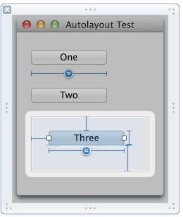
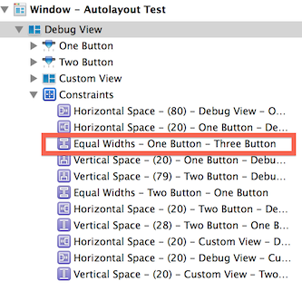
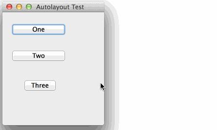

This is a sample project that illustrates the problem I was having with autolayout enforcing constraints across views.

According to Interface Builder, there is an *Equal Width* constraint defined on the *Three* button linking it to the width of the *One* button.

  

However, if you resize the window, the two buttons are not kept the same size.

If I dump out the constraints in the `updateConstraints` method of the containing view, I see the following:

	    "<NSLayoutConstraint:0x608000087da0 H:[one]-(80)-|   (Names: one:0x6080001453e0, '|':BDDebugView:0x6080001455f0 )>",
	    "<NSLayoutConstraint:0x608000087df0 H:|-(20)-[one]   (Names: one:0x6080001453e0, '|':BDDebugView:0x6080001455f0 )>",
	    "<NSLayoutConstraint:0x608000087e90 V:|-(20)-[one]   (Names: one:0x6080001453e0, '|':BDDebugView:0x6080001455f0 )>",
	    "<NSLayoutConstraint:0x608000087ee0 V:|-(79)-[two]   (Names: two:0x608000145960, '|':BDDebugView:0x6080001455f0 )>",
	    "<NSLayoutConstraint:0x608000087f30 two.width == one.width   (Names: two:0x608000145960, one:0x6080001453e0 )>",
	    "<NSLayoutConstraint:0x608000087f80 H:|-(20)-[two]   (Names: two:0x608000145960, '|':BDDebugView:0x6080001455f0 )>",
	    "<NSLayoutConstraint:0x608000087fd0 V:[one]-(28)-[two]   (Names: two:0x608000145960, one:0x6080001453e0 )>",
	    "<NSLayoutConstraint:0x608000088a70 H:|-(20)-[NSView:0x60800012b900]   (Names: '|':BDDebugView:0x6080001455f0 )>",
	    "<NSLayoutConstraint:0x608000088ac0 H:[NSView:0x60800012b900]-(20)-|   (Names: '|':BDDebugView:0x6080001455f0 )>",
	    "<NSLayoutConstraint:0x608000088b10 V:[two]-(20)-[NSView:0x60800012b900]   (Names: two:0x608000145960 )>"

Note that the *Width* constraint between *One* and *Two* is there, but the constraint between *One* and *Three* is **not** there.  If I manually add a *Width* constraint between *One* and *Three* in the *updateConstraints* method using the following code, then the width linkage between the two buttons starts to work.

<pre lang="objc">
	[self addConstraint:[NSLayoutConstraint constraintWithItem:self.b3
	                                                 attribute:NSLayoutAttributeWidth
	                                                 relatedBy:NSLayoutRelationEqual
			                                            toItem:self.b2
	                                                 attribute:NSLayoutAttributeWidth
	                                                multiplier:1.0
		                                              constant:0.0]];
</pre>

Some discussion in [Stack Overflow](http://stackoverflow.com/questions/22656315/enforcing-auto-layout-constraints-across-the-view-hierarchy).